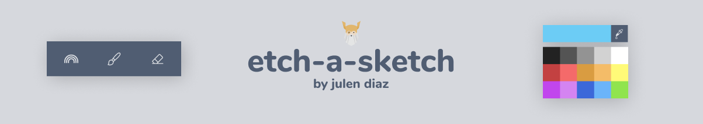
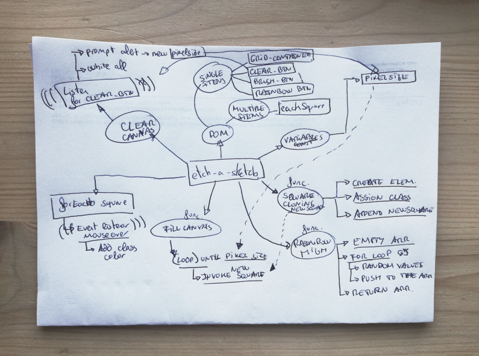

# Etch-a-Sketch | The Odin Project



Go to the [Live Preview](https://shifujulen.github.io/etch-a-sketch/);

## Table of contents

- [Overview](#overview)
- [The challenge](#the-challenge)
- [Key Features](#key-features)
- [My process](#my-process)
  - [Understand the problem](#understand-the-problem)
  - [Pseudocode](#pseudocode)
  - [Mindmap](#mindmap)
  - [Useful sources](#useful-sources)
- [Approaches](#approaches)
  - [Fill Canvas](#fill-canvas)
  - [Clear Canvas](#clear-canvas)
  - [Rainbow Brush](#rainbow-brush)
  - [More Colors](#more-colors)
- [Additional Improvements](#additional-improvements)
- [Attribution](#attribution)
- [Contact](#contact)

## Overview

As The Odin Project claims, this is about building a browser version of something between a sketchpad and an Etch-A-Sketch. Being such a simple but challenging assignment, I chose to previously design a minimalistic approach for the UI.

I wanted to build a project that resembles some of the nowadays software interfaces like Photoshop, Figma or Microsoft Paint 10. Even though at first I will try to build fewer tools just for the sake of completing it, I would like to keep adding more features and transform it into a cool sketching software.

## The Challenge

- [x] Build a browser version of etch-a-sketch
- [x] Put in practice those googling skills
- [x] Set up the 'hovering' effect in the grid
- [x] Add a Rainbow feature for colorful painting
- [x] Implement the Figma Design
- [x] Have fun

## My Process

> Thinking like a Programmer is about having fun with problem-solving

### Understand the problem

- How are we going to create the grid with javascript?
- Methods for arranging div's as a grid?
- Is there a simple way of listening to the hover effect?
  - How to create an event listener for hovering?
  - How to create an event listener for when the mouse leaves?
- How to change the color of the divs?
- How to make the rainbow brush?
- Are margins and borders going to be a problem when appending the squares?
- How can we use the grid method to append each square?
- How to delete all child elements with the DOM?

### Pseudocode

After reading the first chapter of the book "Think like a programmer", I wanted to put in practice that philosophy of "Always have a plan". For this purpose, I spend a few hours researching and thinking about the best way to implement each feature in plain english.

```
Select the grid-container with DOM
Select eachSquare with classSelectorAll
select clear button
Create a variable for pixelSize and assign it a value
Create newSquare function for creating each square and append it to grid container
    Create each square with createElement
    Assign it the class eachSquare
    Append this newSquare to grid-container
Create a function for rainbow colors
    Create an empty array for storing the three values
    Create a for loop until 3 values
        Create an equation for random values between 0 and 255
        Push each random value to the array
    return the array
Function for fillCanvas
    Create loop for inserting eachSquare until pixel size(pixelSize value * pixelSize value)
        Invoke newSquare function
Foreach newSquare (square)
    create an eventListener with mouseover
        square. add class of color to it for the trail
Create a function for clearing the canvas
    Add an event listener for clear button
        foreach newSquare
            add class of white
        prompt alert asking for a new pixelSize value
            pixelSize value is equal to user answer
    invoke fillCanvas again with the new pixelSize value
```

Obviously, after coding for a while, I had to re-arrange blocks and come up with solutions for a few other problems. Overall, it really helped me with speeding up the workflow.

### Mindmap

After finishing up the pseudocode method, I thought that some parts were a bit confusing to digest for my current level. That's why I tried to express each solution and function into a simple mindmap. This way I could visualize all the co-relations between variables and organize all of the ideas.



### Useful Sources

- [Mouseover event listener](https://developer.mozilla.org/en-US/docs/Web/API/Element/mouseover_event);
- [Methods for squaring a number](<https://www.delftstack.com/howto/javascript/javascript-square-a-number/#:~:text=Use%20the%20Math.,-pow()%20Method&text=One%20way%20to%20square%20a,to%20multiply%20it%20by%20itself.>)
- [forEach method](https://developer.mozilla.org/en-US/docs/Web/JavaScript/Reference/Global_Objects/Array/forEach)
- [How to use prompt](https://developer.mozilla.org/en-US/docs/Web/API/Window/prompt)
- [How to delete all child elements with the DOM](https://stackoverflow.com/questions/3955229/remove-all-child-elements-of-a-dom-node-in-javascript)
- [How to get a random Number](https://developer.mozilla.org/en-US/docs/Web/JavaScript/Reference/Global_Objects/Math/random)
- [Video tutorial on how the grid system works](https://www.youtube.com/watch?v=jV8B24rSN5o)
- [How to add a color-picker with html](#https://www.educative.io/edpresso/how-to-add-a-color-picker-in-html)

## Approaches

### Fill Canvas

Being the main feature of the sketchpad, I thought that it was going to be more troublesome. Nevertheless, with the aim of the pseudocode and a deep research into the grid system, I could easily implement this feature.

First I had to build a kind of Square Constructor. In future improvements, I would like to try re-writing this part with object-oriented programming, but for now, let's stick with Vanilla. Inside this constructor, I create each square with dom manipulation and append one single square to the parent grid-container.

```javascript
// Square constructor
let newSquare = function () {
  const singleSquare = document.createElement("div");
  singleSquare.classList.add("square");
  singleSquare.style.backgroundColor = "white";
  // Paint or erase each square
  singleSquare.addEventListener("mouseover", function () {
    if (rainbow) {
      singleSquare.style.backgroundColor = randomRainbow();
    } else if (eraser) {
      singleSquare.style.backgroundColor = "white";
    } else {
      singleSquare.style.backgroundColor = brushColor;
    }
  });
  //  Append each newSquare to grid-container
  gridContainer.appendChild(singleSquare);
};
```

As you can see, I also applied the "mouseover" function in order to listen for each of the selected brushes. After this function, I just had to make a for loop until we could fill the entire grid-container. For this matter, I used math.pow so I could be sure that it was going to be exact.

```javascript
let fillCanvas = (pixelSize) => {
  //  Create loop for filling up all the canvas with squares
  for (let i = 0; i < Math.pow(pixelSize, 2); i++) {
    newSquare();
  }
};
fillCanvas(30);
```

As a final step, I just needed to be sure that the grid-container was displayed as a grid, and had the grid-template-column rule to repeat().

```css
#grid-container {
  width: 500px;
  height: 500px;
  background-color: white;
  margin-top: 2em;
  display: grid;
  grid-template-columns: repeat(30, 1fr);
  box-shadow: rgba(0, 0, 0, 0.1) 0px 10px 50px;
}
```

### Clear Canvas

This problem came out to be much more difficult than expected. First, I had to call a prompt for asking the user to write down a new canvas size. With that new value, I used a template literal for inserting that new value into the repeat() attribute from the grid css. Then it was time to get rid of all the previously inserted squares. The final step was to callback the fillcavas function with the new canvas size.

```javascript
// Clear Canvas
btnClear.addEventListener("click", function () {
  promptMessage("Please enter a new Canvas size");
  gridContainer.style.gridTemplateColumns = `repeat(${pixelSize}, 1fr)`;
  while (gridContainer.firstChild) {
    gridContainer.removeChild(gridContainer.lastChild);
  }
  fillCanvas(pixelSize);
});
```

### Rainbow Brush

One of the optional features that The Odin Project moderators asked for was adding a kind of rainbow brush. So each time the cursor touches a new square, a random rgb value fills this square. So it was as simple as returning a random value from the colors on the side nav and using a template literal to get that value.

```javascript
// Create a random rgb values
let randomRainbow = function () {
  return `${colorsArr[Math.floor(Math.random() * colorsArr.length)]}`;
};
```

As you can see in the square constructor a few approaches above, I used this function when the rainbow variable (When the rainbow brush is selected) is set to true.

### More Colors

After completing the basic features for making the etch-a-sketch work, it was time to start adding some cool ones. In this case, I wanted to create something like a color palette at the side nav so the user could pick one of the few other colors at our disposal.

For this reason, instead of writing them by hand on the html file, I opted for trying to implement them with javascript. This is the code that makes that work.

```javascript
let colorsArr = [
  "#222222",
  "#545454",
  "#939393",
  "#D2D2D2",
  "#FFFFFF",
  "#C34141",
  "#F46A6A",
  "#D99C41",
  "#F4BC68",
  "#FFFA78",
  "#C246ED",
  "#D484F1",
  "#3C68D9",
  "#6BB5F9",
  "#90E44E",
];
let moreColors = function () {
  for (let i = 0; i < colorsArr.length; i++) {
    const newColor = document.createElement("div");
    newColor.style.width = "2em";
    newColor.style.height = "2em";
    newColor.classList.add("picker");
    newColor.style.backgroundColor = colorsArr[i];
    otherColors.appendChild(newColor);
  }
};
moreColors();
```

With the use of a simple loop to itinerate through the different color codes from the array, I could easily append them to a common div.

## Additional Improvements

- [x] Solve hover and focus btn while selecting and painting
- [ ] Clean Code
- [x] Make the prompt only with a number between 1 and 81
- [x] Add a color pickers
- [x] Add a pixelSize bar slide
- [ ] Be able to export the current canvas
- [ ] Design your own icons

## Attribution

- Designed and Developed by Julen Diaz
- Icons by freepik

## Contact

[](https://www.instagram.com/julen.dev/)
[](https://www.linkedin.com/in/julenfront/)
[](https://www.youtube.com/channel/UCUoloquxVnnNLFTD8RwthIQ)
[](https://twitter.com/julendev)
